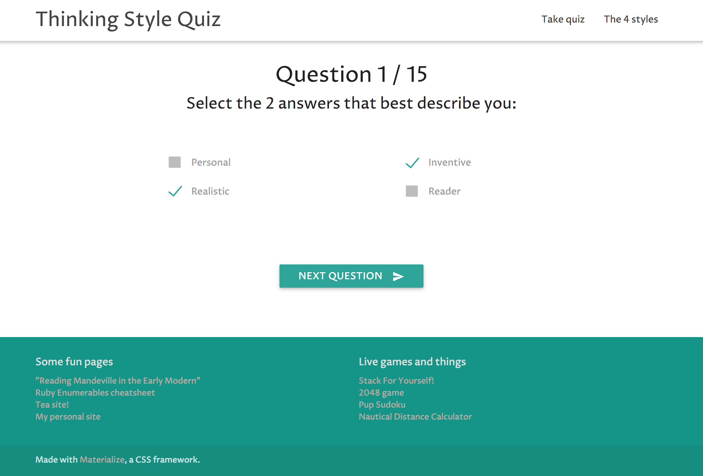

# Thinking Style Quiz

The four thinking styles: a discussion of what they are, links to more sources, and a quiz to see what your thinking style is.

View the [live project here](https://mindplace.github.io/thinking-style-quiz/).
View the [original command line app here](https://github.com/mindplace/nifty_things/tree/master/thinking_style_quiz)

## Technologies

* [Materialize](http://materializecss.com) CSS framework
* Object-oriented JavaScript
* JS [Lodash](https://lodash.com/) libary
* [jQuery](https://jquery.com/)
* [jQuery-viewport-checker](https://github.com/dirkgroenen/jQuery-viewport-checker)
* [jQuery-visible](https://github.com/customd/jquery-visible)
